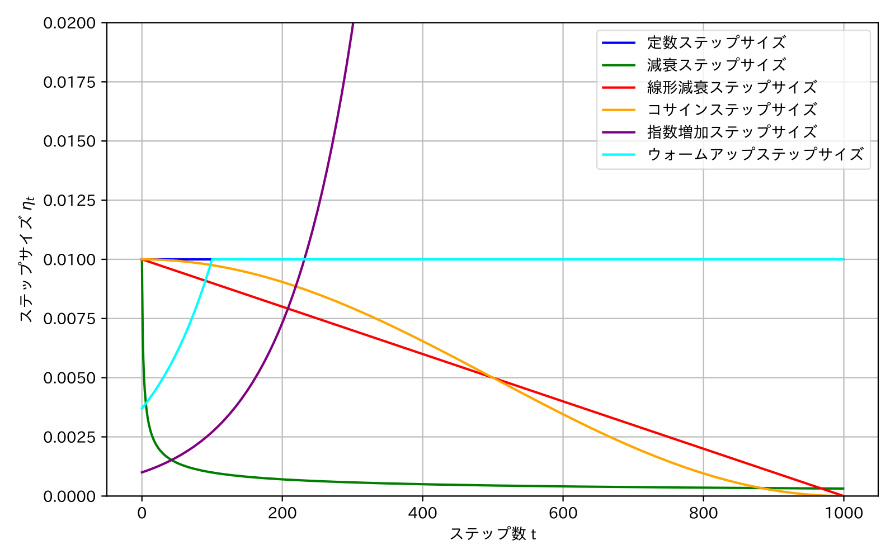
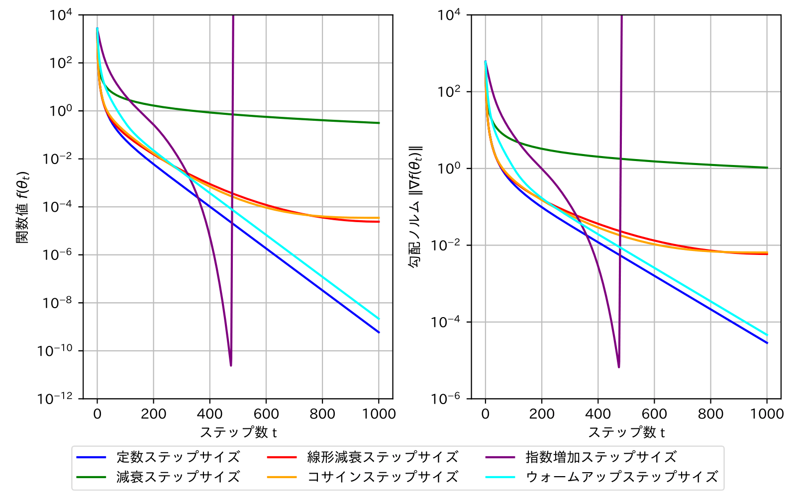
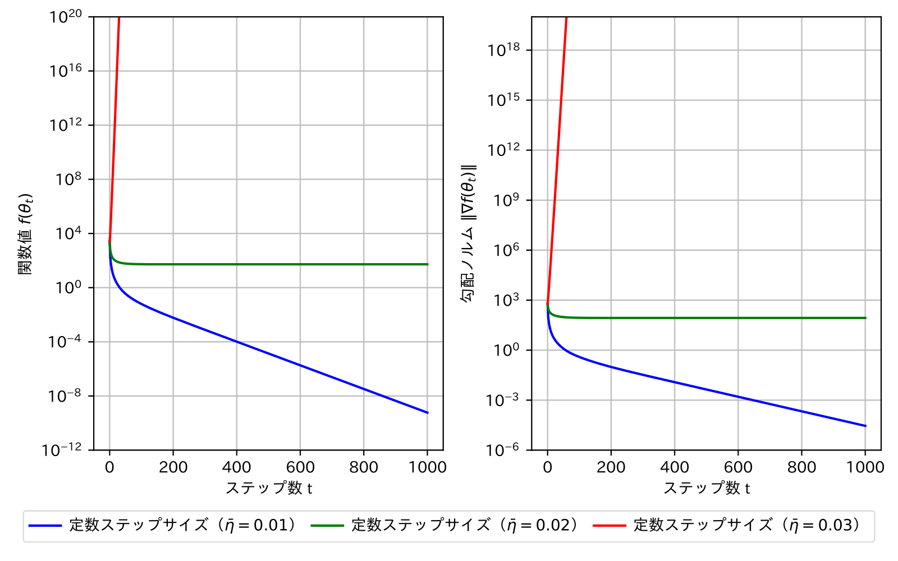

# Gradient Descent on a Convex Quadratic Function
最大固有値 $\lambda_{\max}(X) = 100$ をもつ正定値行列

$$
X=
\begin{pmatrix} 
  1 & 0 & 0 & \dots  & 0 \\
  0 & 2 & 0 & \dots  & 0 \\
  0 & 0 & 3 & \dots  & 0 \\
  \vdots & \vdots & \ddots & \vdots \\
  0 & 0 & 0 & \dots  & 100
\end{pmatrix}
$$

に対して、
$\mathbb{R}^{100}$ 
で定義される2次凸関数

$$
f(\boldsymbol{\theta}) := \frac{1}{2}\langle\boldsymbol{\theta},X\boldsymbol{\theta}\rangle = \frac{1}{2}\left(\theta_1^2+2\theta_2^2+3\theta_3^2+\cdots+100\theta_{100}^2\right)
$$

の大域的最小解
$\boldsymbol{\theta}^{\star}=\boldsymbol{0}$
を探す勾配降下法の実装例です。

## ステップサイズスケジューラ
以下の6つのスケジューラを用いて、ステップサイズを変化させることができます。

［定数ステップサイズ］ $\eta_t = \overline{\eta}$

［減衰ステップサイズ］ $\eta_t = \frac{\overline{\eta}}{\sqrt{t+1}} \ (t \in [0 : T-1])$

［線形減衰ステップサイズ］ $\eta_t = \overline{\eta}\left(1-\frac{t}{T}\right) \ (t \in [0 : T-1])$

［コサインステップサイズ］ $\eta_t = \frac{\overline{\eta}}{2}\left(1+\cos{\frac{t\pi}{T}}\right) \ (t \in [0 : T-1])$

［指数増加ステップサイズ］ $\eta_t = \underline{\eta} r^{t} \ (t \in [0 : T-1])$

［ウォームアップステップサイズ］ $\eta_t = \underline{\eta} r^{t} \ (t \in [0 : T_w]), \quad \eta_t =\underline{\eta} r^{T_w} \ (t \in [T_w : T-1])$

スケジューラの概形は以下の通りです。

## 実験結果
結果１：上記のスケジューラにおける関数値 $f(\bm{\theta}_t)$ と勾配ノルム $\|\nabla f(\bm{\theta}_t)\|$

結果２：定数ステップサイズにおける関数値 $f(\bm{\theta}_t)$ と勾配ノルム $\|\nabla f(\bm{\theta}_t)\|$ の収束と発散

